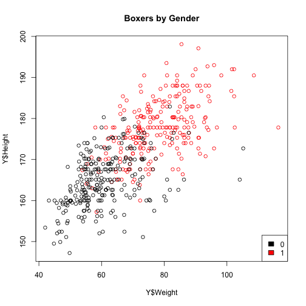
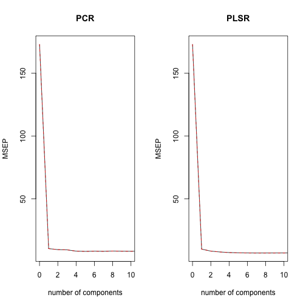
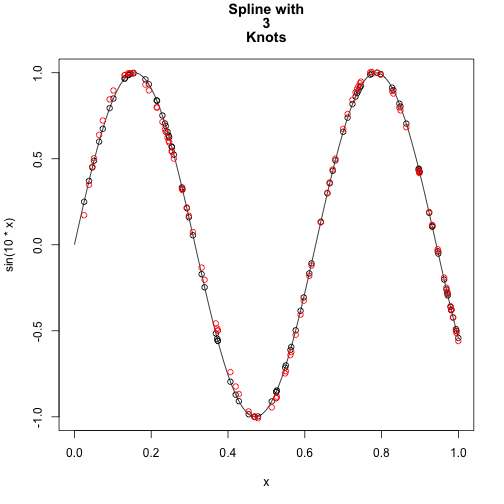
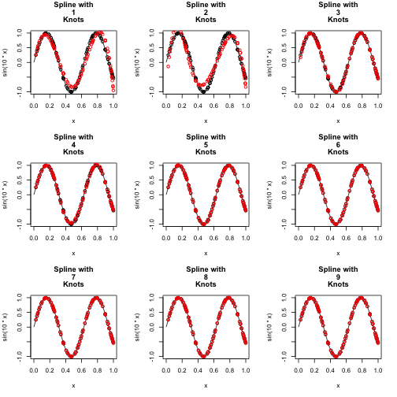

# STATS 216, Homework #3
========================================================
### Aaron Wayne
### Collaborators: Andrew Adams, Roberto Goizueta, Sam Finlayson
--------------------------------------------------------

## Problem 1

a) With k predictors, best subset will have the smallest training RSS because it doesn't have to be a subset of previous sets like forward and backward. By definition it is the best fit to the training data. The other methods can have the same training error as best subet but never a lower training error.

b) With k predictors, it depends on the data. Best subset can potentially overfit if there is high variance and it isn't certain that the best model of the three will be from 

c)

i) True. Forward stepwise does not allow you to drop predictors from one set to the next.

ii) True. For backwards stepwise step k you take the k+1 set and remove one of the predictors.

iii) False. Backwards and forwards don't have to give the same subsets.

iv) False. Again, backwards and forwards don't have to give the same subsets. Having multiple predictors changes how important each predictor is compared to looking at each one individually.

v) True. Since every possible subset is considered in best subset, one of the subsets in k must be a subset of a k+1 subset.


## Problem 2

a) This is simply equal to 0. The only possible function in which itself is 0 to not have an infinite penalty is 0.

b) This is a straight horizontal line because its first derivative must be 0 to not have an infinite penalty. This will be at the average y value.

c) This is a straight line because there is an infinite penalty for a second derivative so it must equal 0. This is the linear least squares line.

d) This is a quadratic because its third derivative is 0.

e) This is the very wiggly function that completely interpolates the data.

## Problem 3

### a

```r
load("./body.RData")
plot(Y$Weight, Y$Height, col = Y$Gender + 1, main = "Boxers by Gender")
legend("bottomright", legend = c("0", "1"), fill = c(1, 2))
```

 


It appears that "1" corresponds to "Male".

### b


```r
library(pls)
```

```
## 
## Attaching package: 'pls'
## 
## The following object is masked from 'package:stats':
## 
##     loadings
```

```r

test = sort(sample(1:nrow(X), 200))
train = (1:nrow(X))[-test]

pcr.form <- pcr(Y$Weight ~ ., data = X, subset = train, scale = T, validation = "CV")
plsr.form <- plsr(Y$Weight ~ ., data = X, subset = train, scale = T, validation = "CV")
```


Although all of the data points are measured in the units (cm), these units have a very different meaning for each of the body parts being measured.  We are interested in the relative variation in each body part, which may be different for each variable.


### c


```r
summary(pcr.form)
```

```
## Data: 	X dimension: 307 21 
## 	Y dimension: 307 1
## Fit method: svdpc
## Number of components considered: 21
## 
## VALIDATION: RMSEP
## Cross-validated using 10 random segments.
##        (Intercept)  1 comps  2 comps  3 comps  4 comps  5 comps  6 comps
## CV           13.16    3.225    3.099    3.073    2.897    2.866    2.893
## adjCV        13.16    3.224    3.098    3.079    2.895    2.861    2.889
##        7 comps  8 comps  9 comps  10 comps  11 comps  12 comps  13 comps
## CV       2.872    2.910    2.887     2.880     2.889     2.891     2.908
## adjCV    2.868    2.907    2.882     2.873     2.881     2.880     2.900
##        14 comps  15 comps  16 comps  17 comps  18 comps  19 comps
## CV        2.898     2.866     2.708     2.646     2.632     2.649
## adjCV     2.890     2.865     2.696     2.626     2.621     2.638
##        20 comps  21 comps
## CV        2.653     2.663
## adjCV     2.642     2.651
## 
## TRAINING: % variance explained
##           1 comps  2 comps  3 comps  4 comps  5 comps  6 comps  7 comps
## X           63.91    75.06    79.84    84.22    86.49    88.56    90.33
## Y$Weight    94.02    94.50    94.66    95.30    95.42    95.43    95.51
##           8 comps  9 comps  10 comps  11 comps  12 comps  13 comps
## X           91.68    92.99     94.22     95.20     96.04     96.85
## Y$Weight    95.52    95.57     95.65     95.67     95.69     95.69
##           14 comps  15 comps  16 comps  17 comps  18 comps  19 comps
## X            97.58     98.11     98.60     99.01     99.40     99.62
## Y$Weight     95.74     95.95     96.36     96.51     96.54     96.54
##           20 comps  21 comps
## X            99.83    100.00
## Y$Weight     96.55     96.55
```

```r
summary(plsr.form)
```

```
## Data: 	X dimension: 307 21 
## 	Y dimension: 307 1
## Fit method: kernelpls
## Number of components considered: 21
## 
## VALIDATION: RMSEP
## Cross-validated using 10 random segments.
##        (Intercept)  1 comps  2 comps  3 comps  4 comps  5 comps  6 comps
## CV           13.16    3.150    2.887    2.767    2.683    2.645    2.624
## adjCV        13.16    3.149    2.885    2.762    2.673    2.634    2.614
##        7 comps  8 comps  9 comps  10 comps  11 comps  12 comps  13 comps
## CV       2.614    2.616    2.619     2.622     2.623     2.624     2.624
## adjCV    2.605    2.607    2.609     2.612     2.613     2.614     2.615
##        14 comps  15 comps  16 comps  17 comps  18 comps  19 comps
## CV        2.624     2.625     2.624     2.625     2.625     2.625
## adjCV     2.615     2.615     2.615     2.615     2.615     2.615
##        20 comps  21 comps
## CV        2.625     2.625
## adjCV     2.615     2.615
## 
## TRAINING: % variance explained
##           1 comps  2 comps  3 comps  4 comps  5 comps  6 comps  7 comps
## X           63.90    73.21    79.01    80.85    83.08    86.56    88.24
## Y$Weight    94.31    95.39    95.89    96.34    96.49    96.53    96.54
##           8 comps  9 comps  10 comps  11 comps  12 comps  13 comps
## X           89.55    90.59     91.66     93.16     93.96     94.75
## Y$Weight    96.54    96.55     96.55     96.55     96.55     96.55
##           14 comps  15 comps  16 comps  17 comps  18 comps  19 comps
## X            95.63     96.33     97.18     97.88     98.56     99.00
## Y$Weight     96.55     96.55     96.55     96.55     96.55     96.55
##           20 comps  21 comps
## X            99.76    100.00
## Y$Weight     96.55     96.55
```


As seen above, PCR tends to explain a higher percentage of the variance accross X, whereas PLSR tends to explain a higher percentage of variance accross Y.  This isn't surprising, since PCR is unsupervised and PLSR is supervised.  PCR reduces the dimensionality of the variables by explaining as high a percentage of their variance as possible -- this is done on the assumption that the variance of the predictors will correlate with the variance of the response.  PLSR does not rely on this assumption as heavily, and as such reduces the dimensionality AFTER determining the set of features that are predictive of Y.

#### d


```r
par(mfrow = c(1, 2))
validationplot(pcr.form, main = "PCR", val.type = "MSEP", xlim = c(0, 10))
validationplot(plsr.form, main = "PLSR", val.type = "MSEP", xlim = c(0, 10))
```

 


The minimum values of the MSEP appear to occur close to 3 components for PCR and 2 components for PLSR, so those are likely the number of components we would pick.  However, if we were to be conservative, we might pick a single component from each, since the *vast* majority of the predictive value of the models comes from the first component in each case.

#### e

We begin by examining the loading values for each of the components we which to use:


```r
pcr.form$loadings[, 1:3]
```

```
##                     Comp 1   Comp 2    Comp 3
## Wrist.Diam          0.2302 -0.18952 -0.086716
## Wrist.Girth         0.2426 -0.17947  0.044585
## Forearm.Girth       0.2516 -0.13801  0.141500
## Elbow.Diam          0.2406 -0.18075 -0.109276
## Bicep.Girth         0.2474 -0.09362  0.190700
## Shoulder.Girth      0.2463 -0.16366  0.112919
## Biacromial.Diam     0.2107 -0.24189 -0.163438
## Chest.Depth         0.2188 -0.05826  0.053273
## Chest.Diam          0.2330 -0.15553 -0.009229
## Chest.Girth         0.2513 -0.12929  0.073510
## Navel.Girth         0.1892  0.30394 -0.071827
## Waist.Girth         0.2428  0.01056 -0.012288
## Pelvic.Breadth      0.1260  0.30426 -0.639623
## Bitrochanteric.Diam 0.1867  0.26750 -0.387024
## Hip.Girth           0.1954  0.40134  0.091780
## Thigh.Girth         0.1295  0.46031  0.369418
## Knee.Diam           0.2262  0.03829 -0.111050
## Knee.Girth          0.2120  0.24352  0.152572
## Calf.Girth          0.2097  0.17375  0.237861
## Ankle.Diam          0.2164 -0.14041 -0.235971
## Ankle.Girth         0.2193  0.03924  0.131886
```

```r
plsr.form$loadings[, 1:2]
```

```
##                     Comp 1   Comp 2
## Wrist.Diam          0.2290 -0.28638
## Wrist.Girth         0.2416 -0.26156
## Forearm.Girth       0.2511 -0.13391
## Elbow.Diam          0.2395 -0.26744
## Bicep.Girth         0.2474 -0.03263
## Shoulder.Girth      0.2460 -0.10046
## Biacromial.Diam     0.2094 -0.28528
## Chest.Depth         0.2192  0.05568
## Chest.Diam          0.2327 -0.09819
## Chest.Girth         0.2512 -0.04284
## Navel.Girth         0.1912  0.39545
## Waist.Girth         0.2435  0.11789
## Pelvic.Breadth      0.1273  0.22918
## Bitrochanteric.Diam 0.1878  0.17426
## Hip.Girth           0.1978  0.47242
## Thigh.Girth         0.1323  0.56594
## Knee.Diam           0.2260 -0.09051
## Knee.Girth          0.2132  0.19931
## Calf.Girth          0.2104  0.10725
## Ankle.Diam          0.2152 -0.28704
## Ankle.Girth         0.2192 -0.05944
```


With both models, almost every variable receives a substantial weight.  As such, we can not immediately remove any of the variables.  We will try some subset selection methods instead.

First, best subsets:


```r
library(leaps)
regfit.full = regsubsets(Y$Weight ~ ., data = X, subset = train)
summary(regfit.full)
```

```
## Subset selection object
## Call: regsubsets.formula(Y$Weight ~ ., data = X, subset = train)
## 21 Variables  (and intercept)
##                     Forced in Forced out
## Wrist.Diam              FALSE      FALSE
## Wrist.Girth             FALSE      FALSE
## Forearm.Girth           FALSE      FALSE
## Elbow.Diam              FALSE      FALSE
## Bicep.Girth             FALSE      FALSE
## Shoulder.Girth          FALSE      FALSE
## Biacromial.Diam         FALSE      FALSE
## Chest.Depth             FALSE      FALSE
## Chest.Diam              FALSE      FALSE
## Chest.Girth             FALSE      FALSE
## Navel.Girth             FALSE      FALSE
## Waist.Girth             FALSE      FALSE
## Pelvic.Breadth          FALSE      FALSE
## Bitrochanteric.Diam     FALSE      FALSE
## Hip.Girth               FALSE      FALSE
## Thigh.Girth             FALSE      FALSE
## Knee.Diam               FALSE      FALSE
## Knee.Girth              FALSE      FALSE
## Calf.Girth              FALSE      FALSE
## Ankle.Diam              FALSE      FALSE
## Ankle.Girth             FALSE      FALSE
## 1 subsets of each size up to 8
## Selection Algorithm: exhaustive
##          Wrist.Diam Wrist.Girth Forearm.Girth Elbow.Diam Bicep.Girth
## 1  ( 1 ) " "        " "         " "           " "        " "        
## 2  ( 1 ) " "        " "         " "           " "        " "        
## 3  ( 1 ) " "        " "         " "           "*"        " "        
## 4  ( 1 ) " "        " "         " "           "*"        " "        
## 5  ( 1 ) " "        " "         " "           "*"        " "        
## 6  ( 1 ) " "        " "         " "           "*"        " "        
## 7  ( 1 ) " "        " "         " "           "*"        " "        
## 8  ( 1 ) " "        " "         "*"           "*"        " "        
##          Shoulder.Girth Biacromial.Diam Chest.Depth Chest.Diam Chest.Girth
## 1  ( 1 ) " "            " "             " "         " "        " "        
## 2  ( 1 ) " "            " "             " "         " "        "*"        
## 3  ( 1 ) " "            " "             " "         " "        " "        
## 4  ( 1 ) "*"            " "             " "         " "        " "        
## 5  ( 1 ) "*"            " "             " "         " "        " "        
## 6  ( 1 ) "*"            " "             " "         " "        " "        
## 7  ( 1 ) "*"            "*"             " "         " "        " "        
## 8  ( 1 ) "*"            "*"             " "         " "        " "        
##          Navel.Girth Waist.Girth Pelvic.Breadth Bitrochanteric.Diam
## 1  ( 1 ) " "         "*"         " "            " "                
## 2  ( 1 ) " "         " "         " "            " "                
## 3  ( 1 ) " "         "*"         " "            " "                
## 4  ( 1 ) " "         "*"         " "            " "                
## 5  ( 1 ) " "         "*"         " "            " "                
## 6  ( 1 ) " "         "*"         "*"            " "                
## 7  ( 1 ) " "         "*"         "*"            " "                
## 8  ( 1 ) " "         "*"         "*"            " "                
##          Hip.Girth Thigh.Girth Knee.Diam Knee.Girth Calf.Girth Ankle.Diam
## 1  ( 1 ) " "       " "         " "       " "        " "        " "       
## 2  ( 1 ) " "       " "         " "       "*"        " "        " "       
## 3  ( 1 ) " "       "*"         " "       " "        " "        " "       
## 4  ( 1 ) " "       "*"         " "       " "        " "        " "       
## 5  ( 1 ) " "       "*"         " "       "*"        " "        " "       
## 6  ( 1 ) " "       "*"         " "       "*"        " "        " "       
## 7  ( 1 ) " "       "*"         " "       "*"        " "        " "       
## 8  ( 1 ) " "       "*"         " "       "*"        " "        " "       
##          Ankle.Girth
## 1  ( 1 ) " "        
## 2  ( 1 ) " "        
## 3  ( 1 ) " "        
## 4  ( 1 ) " "        
## 5  ( 1 ) " "        
## 6  ( 1 ) " "        
## 7  ( 1 ) " "        
## 8  ( 1 ) " "
```


Waist girth, hip girth, forearm girth, shoulder girth, and knee girth seem to be the initially salient variables.

Finally, the LASSO:


```r
dev.off()
```

```
## null device 
##           1
```

```r
library(glmnet)
```

```
## Loading required package: Matrix
## Loading required package: lattice
## Loaded glmnet 1.9-5
```

```r
grid = 10^seq(10, -2, length = 100)
lasso.mod <- glmnet(as.matrix(X[train, ]), Y$Weight[train], alpha = 1, lambda = grid)

plot(lasso.mod, label = T)
legend("bottomleft", names(X), fill = (1:length(names(X))), cex = 0.5, ncol = 3)
```


This seems to select similar, but slightly different variables.

#### f


```r
pcr.pred <- predict(pcr.form, X[test, ], ncomp = 2)
mean((pcr.pred - Y$Weight[test])^2)
```

```
## [1] 10.75
```

```r

plrs.pred <- predict(plsr.form, X[test, ], ncomp = 3)
mean((plrs.pred - Y$Weight[test])^2)
```

```
## [1] 8.791
```

```r

cv.out <- cv.glmnet(as.matrix(X[train, ]), Y$Weight[train], alpha = 1)
bestlam <- cv.out$lambda.min
lasso.pred <- predict(lasso.mod, s = bestlam, newx = as.matrix(X[test, ]))
mean((lasso.pred - Y$Weight[test])^2)
```

```
## [1] 8.787
```


LASSO by a nose!


## Problem 4

#### a

```r
h <- function(x, y) {
    if (x > y) {
        return((x - y)^3)
    } else {
        return(0)
    }
}
```


#### b


```r
hs <- function(xs, z) {
    sapply(xs, h, z)
}
```


#### c


```r
splinebasis <- function(xs, zs) {
    cbind(xs, xs^2, xs^3, sapply(zs, function(z) hs(xs, z)))
}
```


#### d


```r
set.seed(1337)
x = runif(100)
y = sin(10 * x)
```


#### e


```r

knots <- function(k) {
    1:k/(k + 1)
}

plotSpline <- function(k) {
    lm.fit <- lm(y ~ splinebasis(x, knots(k)))
    
    curve(sin(10 * x), main = paste(c("Spline with", k, "Knots", collapse = " ")))
    points(x, y)
    points(x, predict(lm.fit), col = 2)
}

plotSpline(3)
```

 


#### f


```r
par(mfrow = c(3, 3))
sapply(1:9, plotSpline)
```

 

```
## [[1]]
## NULL
## 
## [[2]]
## NULL
## 
## [[3]]
## NULL
## 
## [[4]]
## NULL
## 
## [[5]]
## NULL
## 
## [[6]]
## NULL
## 
## [[7]]
## NULL
## 
## [[8]]
## NULL
## 
## [[9]]
## NULL
```

```r
dev.off()
```

```
## null device 
##           1
```


#### g


```r
library(boot)
```

```
## 
## Attaching package: 'boot'
## 
## The following object is masked from 'package:lattice':
## 
##     melanoma
```

```r
cvKnots <- function(numKnots) {
    cv.error.10 <- rep(0, numKnots)
    dat = data.frame(cbind(y, x))
    for (k in 1:numKnots) {
        glm.fit <- glm(y ~ splinebasis(x, knots(k)), data = dat)
        cv.error.10[k] <- cv.glm(dat, glm.fit, K = 10)$delta[1]
    }
    
    plot(cv.error.10, type = "b", main = "10-Fold CV Error \n By Number of Knots", 
        xlab = "knots", ylab = "Prediction MSE")
    which.min(cv.error.10)
}

cvKnots(10)
```

 

```
## [1] 10
```

```r
# cvKnots(25)
```


