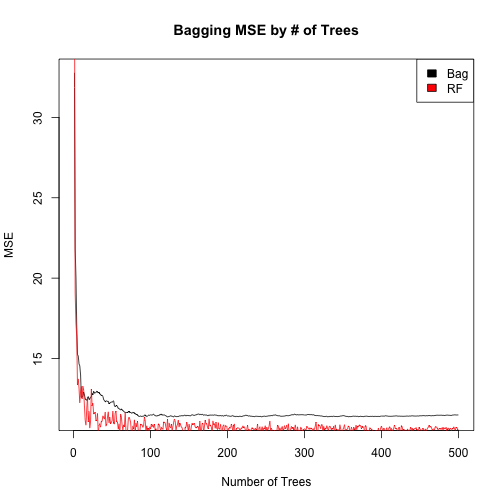
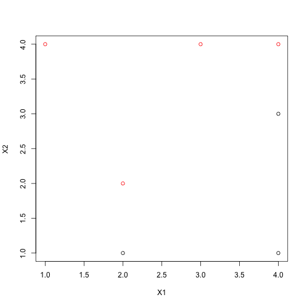
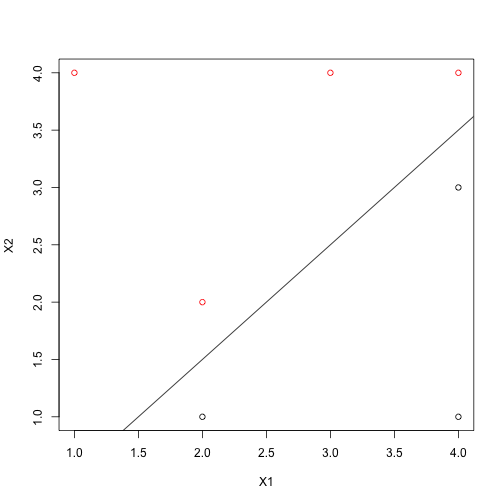
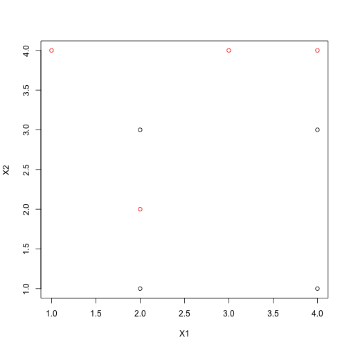

# STATS 216, Homework #4
========================================================
### Aaron Wayne
### March 11, 2014
### Collaborators: Andrew Adams, Roberto Goizueta, Sam Finlayson
--------------------------------------------------------

## Problem 1

#a


```r
load("../body.RData")
set.seed(1)
library(randomForest)
```

```
## randomForest 4.6-7
## Type rfNews() to see new features/changes/bug fixes.
```

```r

test = sort(sample(1:nrow(X), 200))
train = (1:nrow(X))[-test]

mseWeightBag <- function(n, verbose = F) {
    set.seed(1)
    if (verbose & !(n%%10)) {
        print(paste(c("Finished", n, "Records"), collapse = " "))
    }
    bag.weight <- randomForest(Y$Weight ~ ., data = X, subset = train, mtry = length(X), 
        ntree = n, importance = TRUE)
    yhat.bag = predict(bag.weight, newdata = X[-train, ])
    mse.bag <- mean((yhat.bag - Y$Weight[-train])^2)
    
    rf.weight <- randomForest(Y$Weight ~ ., data = X, subset = train, mtry = floor(sqrt(length(X))), 
        ntree = n, importance = TRUE)
    yhat.rf = predict(rf.weight, newdata = X[-train, ])
    mse.rf <- mean((yhat.rf - Y$Weight[-train])^2)
    cbind(mse.bag, mse.rf)
}

mse.bag.rf <- t(sapply(1:500, mseWeightBag, verbose = T))
```

```
## [1] "Finished 10 Records"
## [1] "Finished 20 Records"
## [1] "Finished 30 Records"
## [1] "Finished 40 Records"
## [1] "Finished 50 Records"
## [1] "Finished 60 Records"
## [1] "Finished 70 Records"
## [1] "Finished 80 Records"
## [1] "Finished 90 Records"
## [1] "Finished 100 Records"
## [1] "Finished 110 Records"
## [1] "Finished 120 Records"
## [1] "Finished 130 Records"
## [1] "Finished 140 Records"
## [1] "Finished 150 Records"
## [1] "Finished 160 Records"
## [1] "Finished 170 Records"
## [1] "Finished 180 Records"
## [1] "Finished 190 Records"
## [1] "Finished 200 Records"
## [1] "Finished 210 Records"
## [1] "Finished 220 Records"
## [1] "Finished 230 Records"
## [1] "Finished 240 Records"
## [1] "Finished 250 Records"
## [1] "Finished 260 Records"
## [1] "Finished 270 Records"
## [1] "Finished 280 Records"
## [1] "Finished 290 Records"
## [1] "Finished 300 Records"
## [1] "Finished 310 Records"
## [1] "Finished 320 Records"
## [1] "Finished 330 Records"
## [1] "Finished 340 Records"
## [1] "Finished 350 Records"
## [1] "Finished 360 Records"
## [1] "Finished 370 Records"
## [1] "Finished 380 Records"
## [1] "Finished 390 Records"
## [1] "Finished 400 Records"
## [1] "Finished 410 Records"
## [1] "Finished 420 Records"
## [1] "Finished 430 Records"
## [1] "Finished 440 Records"
## [1] "Finished 450 Records"
## [1] "Finished 460 Records"
## [1] "Finished 470 Records"
## [1] "Finished 480 Records"
## [1] "Finished 490 Records"
## [1] "Finished 500 Records"
```

```r

plot(mse.bag.rf[, 1], main = "Bagging MSE by # of Trees", type = "l", xlab = "Number of Trees", 
    ylab = "MSE")
lines(mse.bag.rf[, 2], col = "red")
legend("topright", legend = c("Bag", "RF"), fill = c("black", "red"))
```

 

```r

rf.weight <- randomForest(Y$Weight ~ ., data = X, subset = train, mtry = floor(sqrt(length(X))), 
    ntree = 500, importance = TRUE)

bag.weight <- randomForest(Y$Weight ~ ., data = X, subset = train, mtry = length(X), 
    ntree = 500, importance = TRUE)

# Importance Plots
varImpPlot(rf.weight)
```

 

```r
varImpPlot(bag.weight)
```

 

```r

# Increase MSE
intersect(names(head(sort(importance(rf.weight)[, 1], decreasing = T), n = 5)), 
    names(head(sort(importance(bag.weight)[, 1], decreasing = T), n = 5)))
```

```
## [1] "Hip.Girth"   "Knee.Girth"  "Waist.Girth" "Calf.Girth"
```

```r

# RSS
intersect(names(head(sort(importance(rf.weight)[, 2], decreasing = T), n = 5)), 
    names(head(sort(importance(bag.weight)[, 2], decreasing = T), n = 5)))
```

```
## [1] "Waist.Girth"   "Chest.Girth"   "Bicep.Girth"   "Forearm.Girth"
```

```r

yhat.bag = predict(bag.weight, newdata = X[-train, ])
(mse.bag <- mean((yhat.bag - Y$Weight[-train])^2))
```

```
## [1] 11.26
```

```r

yhat.rf = predict(rf.weight, newdata = X[-train, ])
(mse.rf <- mean((yhat.rf - Y$Weight[-train])^2))
```

```
## [1] 10.57
```

Our HW # 3 results were as follows: PCR MSE: 10.03 PLRS MSE: 8.757 LASSO: 8.13

It appears that all of these methods outperformed both our bag and our random forest.

#d

It appears from the plot above that there continues to be variance and the MSE continues to drop slightly. This implies that 500 may not be enough trees.

##2

#a


```r
dat.X <- data.frame(matrix(c(3, 4, 2, 2, 4, 4, 1, 4, 2, 1, 4, 3, 4, 1), byrow = T, 
    ncol = 2))
dat.Y <- c(rep(2, 4), rep(1, 3))
dat <- data.frame(dat.X, Y = as.factor(dat.Y))

plot(dat.X, type = "p", col = dat.Y)
```

 

#b

```r
library(e1071)
```

```
## Loading required package: class
```

```r

svmfit <- svm(Y ~ ., data = dat, kernel = "linear", cost = 1e+50, scale = F)
beta1 <- drop(t(svmfit$coefs) %*% dat.X[svmfit$index, 1])
beta2 <- drop(t(svmfit$coefs) %*% dat.X[svmfit$index, 2])
beta0 <- svmfit$rho

plot(dat.X, type = "p", col = dat.Y)
abline(beta0/beta2, -beta1/beta2)
```

 

```r

cat(paste(c("Formula :", -beta0/beta2, "+", beta1/beta2, "* X_1", "+", 1, "* X_2", 
    "= 0"), collapse = " "))
```

```
## Formula : 0.500281643260406 + -1.00007681179829 * X_1 + 1 * X_2 = 0
```

```r

svmfit$index
```

```
## [1] 2 3 6
```

#c

```r
# cat(paste(c('Classify to Red if', -beta0/beta2, '+', beta1/beta2, '* X_1'
# ,'+', 1, '* X_2', '> 0, and Classify to Blue Otherwise'), collapse=' '))

```


Classify to Red if 0.500281643260406 + -1.00007681179829 * X_1 + 1 * X_2 > 0, and Classify to Blue Otherwise

#d

```r
plot(dat.X, type = "p", col = dat.Y)
abline(beta0/beta2, -beta1/beta2)
abline((beta0 - 1)/beta2, -beta1/beta2, lty = 2)
abline((beta0 + 1)/beta2, -beta1/beta2, lty = 2)
```

 

```r

# The margin is:
(abs((1)/beta2)/sqrt((-beta1/beta2)^2 + 1))
```

```
## [1] 0.3536
```


#e

The support vectors for the maximal margin classifier are (2,2), (4,2), and (4,4).

#f

The maximal marginal hyperplane only depends on the support vectors. Since the seventh observation is not a support vector, moving itn will not affect the classifier unless it is moved sufficiently to cross the boundary and become a support vector.

#g

```r
svmfit <- svm(Y ~ ., data = dat, kernel = "linear", cost = 0.8, scale = F)
beta1 <- drop(t(svmfit$coefs) %*% dat.X[svmfit$index, 1])
beta2 <- drop(t(svmfit$coefs) %*% dat.X[svmfit$index, 2])
beta0 <- svmfit$rho

plot(dat.X, type = "p", col = dat.Y)
abline(beta0/beta2, -beta1/beta2)
```

 

```r

cat(paste(c("Formula :", -beta0/beta2, "+", beta1/beta2, "* X_1", "+", 1, "* X_2", 
    "= 0"), collapse = " "))
```

```
## Formula : -1.14516129032258 + -0.451612903225805 * X_1 + 1 * X_2 = 0
```


#h

```r
dat.X = rbind(dat.X, c(2, 3))
dat.Y <- c(rep(2, 4), rep(1, 4))
plot(dat.X, type = "p", col = dat.Y)
```

 

```r

```


##3

#a

```r
library(ISLR)
set.seed(1)
train <- sample(nrow(OJ), 800)
dat.train <- OJ[train, ]
dat.test <- OJ[-train, ]
```


#b

```r
svmfit <- svm(Purchase ~ ., data = dat.train, kernel = "linear", cost = 0.01)
summary(svmfit)
```

```
## 
## Call:
## svm(formula = Purchase ~ ., data = dat.train, kernel = "linear", 
##     cost = 0.01)
## 
## 
## Parameters:
##    SVM-Type:  C-classification 
##  SVM-Kernel:  linear 
##        cost:  0.01 
##       gamma:  0.05556 
## 
## Number of Support Vectors:  432
## 
##  ( 215 217 )
## 
## 
## Number of Classes:  2 
## 
## Levels: 
##  CH MM
```

There are 432 Support Vectors, which seems like a very large number.


```r
plot(dat.train)
```

 

With 800 observations and significant correlation in among many variables, it is perhaps not so surprising.

#c

```r
(lin.svm.train.err <- 1 - mean(predict(svmfit) == dat.train$Purchase))
```

```
## [1] 0.1663
```

```r
(lin.svm.test.err <- 1 - mean(predict(svmfit, dat.test) == dat.test$Purchase))
```

```
## [1] 0.1815
```


#d

```r
tune.out <- tune(svm, Purchase ~ ., data = dat.train, kernel = "linear", ranges = list(cost = c(0.01, 
    0.1, 1, 5, 10)))
summary(tune.out)
```

```
## 
## Parameter tuning of 'svm':
## 
## - sampling method: 10-fold cross validation 
## 
## - best parameters:
##  cost
##   0.1
## 
## - best performance: 0.1625 
## 
## - Detailed performance results:
##    cost  error dispersion
## 1  0.01 0.1663    0.05139
## 2  0.10 0.1625    0.04895
## 3  1.00 0.1688    0.04723
## 4  5.00 0.1675    0.05041
## 5 10.00 0.1650    0.04993
```

Based on these costs, our best cost is 0.1 since the error is the lowest here.

#e

```r
svmfit <- svm(Purchase ~ ., data = dat.train, kernel = "linear", cost = 0.1)
summary(svmfit)
```

```
## 
## Call:
## svm(formula = Purchase ~ ., data = dat.train, kernel = "linear", 
##     cost = 0.1)
## 
## 
## Parameters:
##    SVM-Type:  C-classification 
##  SVM-Kernel:  linear 
##        cost:  0.1 
##       gamma:  0.05556 
## 
## Number of Support Vectors:  343
## 
##  ( 171 172 )
## 
## 
## Number of Classes:  2 
## 
## Levels: 
##  CH MM
```

```r

1 - mean(predict(svmfit) == dat.train$Purchase)
```

```
## [1] 0.1587
```

```r
1 - mean(predict(svmfit, dat.test) == dat.test$Purchase)
```

```
## [1] 0.1889
```

It appears that we have slightly overfit the data relative to the cost of 0.01. Our test error has gone up while our training error has gone down.

#f

```r
svmfit <- svm(Purchase ~ ., data = dat.train, kernel = "radial", cost = 0.01)

1 - mean(predict(svmfit) == dat.train$Purchase)
```

```
## [1] 0.3825
```

```r
1 - mean(predict(svmfit, dat.test) == dat.test$Purchase)
```

```
## [1] 0.4111
```

```r

summary(tune(svm, Purchase ~ ., data = dat.train, kernel = "radial", ranges = list(cost = c(0.01, 
    0.1, 1, 5, 10))))
```

```
## 
## Parameter tuning of 'svm':
## 
## - sampling method: 10-fold cross validation 
## 
## - best parameters:
##  cost
##     5
## 
## - best performance: 0.1712 
## 
## - Detailed performance results:
##    cost  error dispersion
## 1  0.01 0.3825    0.06801
## 2  0.10 0.1825    0.03918
## 3  1.00 0.1762    0.04981
## 4  5.00 0.1712    0.03955
## 5 10.00 0.1825    0.03446
```

```r

svmfit <- svm(Purchase ~ ., data = dat.train, kernel = "radial", cost = 5)

(rad.svm.train.err <- 1 - mean(predict(svmfit) == dat.train$Purchase))
```

```
## [1] 0.1375
```

```r
(rad.svm.test.err <- 1 - mean(predict(svmfit, dat.test) == dat.test$Purchase))
```

```
## [1] 0.1815
```

The cost of 5 significantly reduces both the training and test error rates.

#g

```r
svmfit <- svm(Purchase ~ ., data = dat.train, kernel = "polynomial", cost = 0.01, 
    degree = 2)

1 - mean(predict(svmfit) == dat.train$Purchase)
```

```
## [1] 0.3825
```

```r
1 - mean(predict(svmfit, dat.test) == dat.test$Purchase)
```

```
## [1] 0.4111
```

```r

summary(tune(svm, Purchase ~ ., data = dat.train, kernel = "polynomial", degree = 2, 
    ranges = list(cost = c(0.01, 0.1, 1, 5, 10))))
```

```
## 
## Parameter tuning of 'svm':
## 
## - sampling method: 10-fold cross validation 
## 
## - best parameters:
##  cost
##    10
## 
## - best performance: 0.1713 
## 
## - Detailed performance results:
##    cost  error dispersion
## 1  0.01 0.3825    0.03873
## 2  0.10 0.3300    0.04257
## 3  1.00 0.1975    0.03162
## 4  5.00 0.1737    0.04016
## 5 10.00 0.1713    0.03729
```

```r


svmfit <- svm(Purchase ~ ., data = dat.train, kernel = "polynomial", cost = 10, 
    degree = 2)

(poly.svm.train.err <- 1 - mean(predict(svmfit) == dat.train$Purchase))
```

```
## [1] 0.145
```

```r
(poly.svm.test.err <- 1 - mean(predict(svmfit, dat.test) == dat.test$Purchase))
```

```
## [1] 0.1852
```

The degree 2 polynomial significantly reduces the training and test error rates at cost 10 compared to cost 0.01. We may want to investigate costs larger than 10.

#h

```r
tab <- rbind(c(lin.svm.train.err, lin.svm.test.err), c(rad.svm.train.err, rad.svm.test.err), 
    c(poly.svm.train.err, poly.svm.test.err))

rownames(tab) <- c("Linear", "Radial", "Polynomial")
colnames(tab) <- c("Train Error", "Test Error")

tab
```

```
##            Train Error Test Error
## Linear          0.1663     0.1815
## Radial          0.1375     0.1815
## Polynomial      0.1450     0.1852
```

The best choice is clearly either linear or radial kernel since they have the same and lowest test errors. With only this information, I would probably pick the radial kernel because of the higher training performance. That said, cross validation might reveal that the higher test performance is due to chance and that the radial kernel is actually the better choice.

##4

#a

The proof for this is on the following page.

#b

Sum(W(Ck)) must decrease, or stay the same, with each successive iteration of the K-means algorithm because it is comprised of only two steps and both steps force Sum(W(Ck)) to either decrease or stay the same. The first step is to assign points to the nearest centroid. If a point is moved from one cluster to another, the variance within an individual cluster may increase, W(Ck), but the variance will be decreased over the sum Sum(W(Ck)). The second step is recomputing the centroid. By putting the centroid at the mean of all points in the cluster, we reduce the variance of that cluster as much as possible without reassigning observations. Both of these steps can make the Sum(W(Ck)) stay the same. In that case, the algorithm is done because no observations have been changed clusters and the centroids stay in the same place.

#c

This is a monotonically decreasing function with a finite set. Therefore, there will be at least a local minimum at which the algorithm must converge to. Since it is finite, there is no opportunity for the algorithm to run infinitely.

#d

```r
x <- data.frame(matrix(c(1, 1, 3, 3, 1, 1, 1, 1), byrow = F, ncol = 2))
y <- c(1, 2, 1, 2)
plot(x, col = y)
```

 

```r

centroids <- data.frame(matrix(c(2, 2, 1, 1), byrow = F, ncol = 2))
x
```

```
##   X1 X2
## 1  1  1
## 2  1  1
## 3  3  1
## 4  3  1
```

```r
y
```

```
## [1] 1 2 1 2
```

```r
centroids
```

```
##   X1 X2
## 1  2  1
## 2  2  1
```

